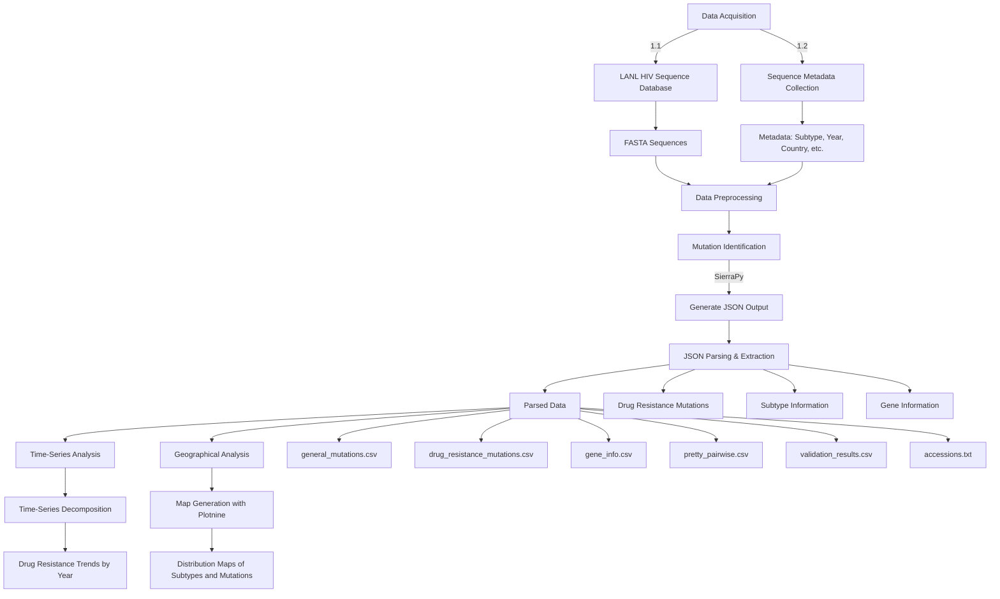

Genomic Landscape of HIV Drug Resistance in Africa: Identifying Mutations and Resistance Patterns in the **pol** Gene (1990–2024)
=================================================================================================================================

### **Project Overview**

This project investigates HIV drug resistance mutations within the **pol** gene across African countries from 1990 to 2024. The **pol** gene, encoding critical enzymes like reverse transcriptase, protease, and integrase, plays a central role in antiretroviral therapy (ART) effectiveness. Over the decades, as ART usage increased, particularly in Sub-Saharan Africa, resistance mutations emerged, challenging the fight against HIV.

We aim to conduct a time-series analysis of HIV-1 sequences from the Los Alamos National Laboratory (LANL) HIV Sequence Database. This analysis will help us identify drug resistance mutations, assess their evolution over time, and explore how ART introduction and scale-up contributed to the development of cross-resistance between drugs.

### **Project Goals**

1.	**Drug Resistance Mutation Identification**: Identify the most common HIV-1 drug resistance mutations in the **pol** gene, with a particular focus on the reverse transcriptase (RT), protease (PR), and integrase (IN) regions.

2.	**Time-Series Analysis**: Perform time-series decomposition of the mutation data, segmenting it into 5-year intervals, and track the impact of ART scale-ups and policy changes on the prevalence of these mutations.

3.	**Geographic Variability**: Analyze drug resistance patterns across different African regions to understand regional differences in mutation prevalence and drug efficacy.

4.	**COVID-19 Impact**: Assess how the COVID-19 pandemic influenced ART treatment disruptions, contributing to resistance development in some regions.

### **Features**

-	**Data Parsing & Analysis**: JSON data from the **SierraPy** tool is parsed to extract key mutation and drug resistance information. This includes drug resistance scores, gene alignment data, mutation descriptions, and strain metadata.

-	**Visualizations**: Generate geographical heatmaps of mutation prevalence by region, mutation time series graphs, and drug resistance score timelines to better understand the dynamics of HIV drug resistance across Africa.

-	**Downstream Analysis**: Includes cross-resistance analysis between drug classes (e.g., NNRTIs, NRTIs, INSTIs) to explore how mutations in one class affect susceptibility to other classes of antiretroviral drugs.

### **Project Structure**

-	**Data Acquisition**:

	-	HIV sequences were retrieved from the **LANL HIV Sequence Database** spanning the years 1990–2024, focusing on sequences containing full or near-complete **pol** gene coverage.
	-	Metadata related to patient history, country of origin, sampling year, and subtype was also extracted to contextualize the mutation data.

-	**Data Preprocessing**:

	-	Sequences were cleaned to remove gaps and ensure that only high-quality sequences were retained for analysis. Sequences flagged as problematic were excluded.  

-	**Mutation Identification**:

	-	The **SierraPy** command-line tool was used to extract drug resistance mutations and drug resistance scores. JSON outputs from **SierraPy** are parsed and processed to extract key mutation data and drug resistance profiles.

-	**Time-Series and Geographic Analysis**:

	-	The sequences were divided into 5-year intervals (e.g., 1990–1994, 1995–1999, etc.) to track the evolution of resistance mutations over time.
	-	Geographic clustering of mutations was done to identify regions where resistance patterns are more severe.

### **Workflow Diagram**



### **File Structure**

1.	**`parse_sierra_json.py`**: This script processes the JSON output from **SierraPy**, extracting drug resistance mutations, gene information, and resistance scores, then saving the data into CSV files.

2.	**`time_series_analysis.py`**: This script performs time-series analysis of the mutation data, allowing users to track the progression of drug resistance mutations across different time periods.

3.	**`geo_analysis.py`**: This script generates maps showing the distribution of drug resistance mutations across different African countries. It integrates **GeoPandas** and **Plotnine** for map visualizations.

4.	**Data Output Files**:

	-	`general_mutations.csv`: Lists general mutations across all sequences.
	-	`drug_resistance_mutations.csv`: Drug resistance mutations and their scores for different ART drugs.
	-	`gene_info.csv`: Details on aligned genes (e.g., gene length, aligned regions).
	-	`pretty_pairwise.csv`: Nucleotide and amino acid alignments from the sequence data.
	-	`validation_results.csv`: Validation data on sequence quality.
	-	`accessions.txt`: List of accession IDs for all sequences processed.

### **Usage Instructions**

1.	**Prerequisites**: Install the following Python libraries:
	-	`biopython`
	-	`pandas`
	-	`plotnine`
	-	`geopandas`
	-	`tqdm`
	-	`seaborn`
	-	`matplotlib`
	-	`lifelines`
	-	`statsmodel`

You will also need **SierraPy** to generate the initial JSON data from HIV-1 FASTA files.

1.	**Running the Scripts**:

	-	**Step 1**: Use `SierraPy` to generate JSON output from your FASTA files.
	-	**Step 2**: Run `parse_sierra_json.py` to process the JSON files and generate CSV outputs.

		```bash
		python parse_sierra_json.py input_dir output_dir
		```

	-	**Step 3**: Use `time_series_analysis.py` to perform time-series decomposition.

	-	**Step 4**: Use `geo_analysis.py` to generate mutation distribution maps.

### **Future Work**

1.	**Advanced Resistance Analysis**: Further exploration into cross-resistance between drug classes will help refine our understanding of HIV mutation pathways and their impact on ART efficacy.

2.	**Visualization Enhancements**: We plan to integrate more advanced visualization tools to depict the spread and evolution of drug resistance mutations over time.

3.	**Machine Learning Models**: Incorporate predictive models to forecast resistance trends based on the introduction of new ART drugs and other external factors like the COVID-19 pandemic.

---

### **Contributors**

-	Halleluyah Darasimi Oludele
-	Koney Shardow Abdul Latif
-	Maame Esi Annor-Apaflo
-	Julien Nguinkal
-	Phazha Bushe Baeti
-	Jonas Paul Ibekwe

### **Acknowledgments**

We acknowledge the **Los Alamos National Laboratory (LANL)** for providing HIV-1 sequence data, and the **Stanford HIVDB** team for making their drug resistance interpretation tools available.

### **References**

-	LANL HIV Sequence Database: https://www.hiv.lanl.gov/
-	Stanford HIVDB: https://hivdb.stanford.edu/  
