Genomic Landscape of HIV Drug Resistance in Nigeria: Identifying Mutations and Conserved Regions for Targeted Therapeutics
--------------------------------------------------------------------------------------------------------------------------

### Project Overview

This project aims to analyze genetic variations in HIV samples from Nigeria to identify commonly mutated genes, understand gene variations, determine conserved genome regions, and focus on mutations associated with drug resistance. The goal is to inform potential therapeutic targets.

### Objective

-	Assess the drug resistance in HIV genomes over time and their significance
-	Finding out new motifs in HIV genome samples that have been conserved over the period of some years.
-	This will help us make generalisations on the current state of therapies and the future of the therapies in this context.

	### Table of Contents

1.	[Data Acquisition](#data-acquisition)
2.	[Quality Control and Preprocessing](#quality-control-and-preprocessing)
3.	[Read Alignment and Variant Calling](#read-alignment-and-variant-calling)
4.	[Functional Annotation of Assembled Genomes](#functional-annotation-of-assembled-genomes)
5.	[Genome Alignment and Variant Detection](#genome-alignment-and-variant-detection)
6.	[Identification of Drug Resistance Mutations](#identification-of-drug-resistance-mutations)
7.	[Data Cleaning and Statistical Analysis](#data-cleaning-and-statistical-analysis)
8.	[Visualization](#visualization)
9.	[Phylogenetic Analysis](#phylogenetic-analysis)
10.	[Identification of Conserved Regions](#identification-of-conserved-regions)
11.	[Report Generation](#report-generation)

### Data Acquisition

-	**Source:** Public repositories such as Los Alamos HIV Database, Sequence Read Archive, and NCBI GenBank.
-	**Data Type:** Assembled RNA genomes of HIV-1, focusing on all subtypes, especially CRF02_AG and G.

### Quality Control and Preprocessing

-	**Tools:** nf-core/viralrecon pipeline
-	**Steps:**
	1.	Perform quality control assessments on the assembled genomes using the nf-core/viralrecon pipeline.
	2.	Assess completeness, contiguity, and accuracy.
	3.	Generate reports to identify and remove low-quality assemblies.

### Read Alignment and Variant Calling

-	**Tools:** BWA, iVar (within nf-core/viralrecon pipeline)
-	**Steps:**
	1.	Align the processed reads to a reference HIV genome using BWA within the nf-core/viralrecon pipeline.
	2.	Identify genetic variations (single nucleotide polymorphisms, insertions, deletions) using variant calling tools like iVar.

### Functional Annotation of Assembled Genomes

-	**Tools:** SnpEff
-	**Steps:**
	1.	Annotate the genomes to identify and classify genes.
	2.	Predict the functional effects of genetic variants using SnpEff.

### Genome Alignment and Variant Detection

-	**Tools:** Parsnp, Harvest Suite, Gingr (for visualization)
-	**Steps:**
	1.	Align the assembled genomes against a reference HIV-1 genome using Parsnp.
	2.	Visualize the alignment using Gingr to identify genomic variations.
	3.	Use the Harvest tools to extract and list variants.

### Identification of Drug Resistance Mutations

-	**Tools:** HIVdb (Stanford University HIV Drug Resistance Database)
-	**Steps:**
	1.	Cross-reference identified variants with known drug resistance mutations.
	2.	Annotate the VCF with drug resistance information using HIVdb.

### Data Cleaning and Statistical Analysis

-	**Tools:** R (tidyverse, dplyr)
-	**Steps:**
	1.	Clean and preprocess variant data to ensure consistency and accuracy.
	2.	Perform statistical analysis to identify significant mutations and their frequencies.
	3.	Use statistical methods to correlate mutations with drug resistance.

### Visualization

-	**Tools:** R (ggplot2)
-	**Steps:**
	1.	Create visualizations of mutation frequencies and distributions.
	2.	Generate plots showing correlations between mutations and drug resistance.

### Phylogenetic Analysis

-	**Tools:** IQ-TREE, R (phyloseq, ggtree)
-	**Steps:**
	1.	Construct phylogenetic trees using IQ-TREE to study evolutionary relationships among HIV strains.
	2.	Analyze the evolutionary dynamics and geographical distribution of HIV strains in Nigeria.

### Identification of Conserved Regions

-	**Tools:** MEME Suite, custom R scripts
-	**Steps:**
	1.	Identify conserved regions across different HIV strains using MEME Suite.
	2.	Focus on regions that are potential targets for therapeutic interventions.

### Report Generation

-	**Contents:**
	1.	Comprehensive report detailing genetic variations and drug resistance mutations.
	2.	Database of identified mutations and their frequencies.
	3.	Phylogenetic trees illustrating evolutionary relationships.
	4.	Identified conserved regions and potential therapeutic targets.
	5.	Visualizations for publication and presentations. ---

### Workflow Diagram

```mermaid
%%{ init: {'theme': 'base', 'themeVariables': { 'edgeStyle': 'straight' }}}%%
graph TD;
    A[Data Acquisition] -->|1| B[nf-core/viralrecon Pipeline];
    B -->|2| C[Quality Control];
    C -->|3| D[High-Quality Assembled Genomes];
    D -->|4| E[BWA Read Alignment];
    E -->|5| F[Aligned Reads];
    F -->|6| G[iVar Variant Calling];
    G -->|7| H[Identified Variants];
    H -->|8| I[SnpEff Functional Annotation];
    I -->|9| J[Annotated Variants];
    J -->|10| K[Parsnp Genome Alignment];
    K -->|11| L[Harvest Suite Variant Detection];
    L -->|12| M[Gingr Visualization];
    M -->|13| N[Variant List];
    N -->|14| O[Cross-reference with HIVdb];
    O -->|15| P[Annotated VCF with Drug Resistance Info];
    P -->|16| Q[R Data Cleaning];
    Q -->|17| R[Cleaned Variant Data];
    R -->|18| S[Statistical Analysis];
    S -->|19| T[Mutation Frequencies and Correlations];
    T -->|20| U[ggplot2 Visualization];
    U -->|21| V[Plots and Graphs];
    R -->|22| W[IQ-TREE Phylogenetic Analysis];
    W -->|23| X[Phylogenetic Trees];
    X -->|24| Y[R Phyloseq Analysis];
    Y -->|25| Z[Evolutionary Dynamics and Geographical Distribution];
    Z -->|26| AA[MEME Suite Analysis];
    AA -->|27| AB[Identification of Conserved Regions];
    AB -->|28| AC[Potential Therapeutic Targets];
    V -->|29| AD[Comprehensive Report];
    X -->|30| AD;
    AC -->|31| AD;
    T -->|32| AD;
    AD -->|33| AE[Final Report for Publication and Presentation];

    %% Define styles
    classDef dataAcq fill:#f9f,stroke:#333,stroke-width:2px;
    classDef pipeline fill:#bbf,stroke:#333,stroke-width:2px;
    classDef qualityControl fill:#fcf,stroke:#333,stroke-width:2px;
    classDef alignment fill:#cfc,stroke:#333,stroke-width:2px;
    classDef variantCalling fill:#ccf,stroke:#333,stroke-width:2px;
    classDef annotation fill:#ffc,stroke:#333,stroke-width:2px;
    classDef visualization fill:#fcc,stroke:#333,stroke-width:2px;
    classDef analysis fill:#c9f,stroke:#333,stroke-width:2px;
    classDef report fill:#9cf,stroke:#333,stroke-width:2px;

    %% Apply styles to nodes
    class A dataAcq;
    class B pipeline;
    class C qualityControl;
    class D pipeline;
    class E alignment;
    class F pipeline;
    class G variantCalling;
    class H pipeline;
    class I annotation;
    class J pipeline;
    class K pipeline;
    class L pipeline;
    class M visualization;
    class N pipeline;
    class O pipeline;
    class P pipeline;
    class Q analysis;
    class R pipeline;
    class S pipeline;
    class T pipeline;
    class U pipeline;
    class V pipeline;
    class W pipeline;
    class X pipeline;
    class Y pipeline;
    class Z pipeline;
    class AA pipeline;
    class AB pipeline;
    class AC pipeline;
    class AD report;
    class AE report;

    linkStyle default interpolate basis;

```

---

### Tools Summary

-	**Quality Control and Preprocessing:** nf-core/viralrecon pipeline
-	**Read Alignment:** BWA (within nf-core/viralrecon pipeline)
-	**Variant Calling:** iVar (within nf-core/viralrecon pipeline)
-	**Genome Annotation:** SnpEff
-	**Genome Alignment:** Parsnp, Gingr
-	**Variant Detection:** Harvest tools
-	**Drug Resistance Analysis:** HIVdb
-	**Statistical Analysis:** R (tidyverse, dplyr)
-	**Visualization:** R (ggplot2)
-	**Phylogenetic Analysis:** IQ-TREE, R (phyloseq, ape)
-	**Conserved Regions Identification:** MEME Suite, custom R scripts

---

Team and Project Contributors
-----------------------------

-	Halleluyah Darasimi Oludele
-	Jonas Ibekwe Paul
-	Maame Esi Annor-Apaflo
-	Julien A. Nguinkal
-	Koney Shardow Abdul Latif
-	Phazha Bushe Baeti
